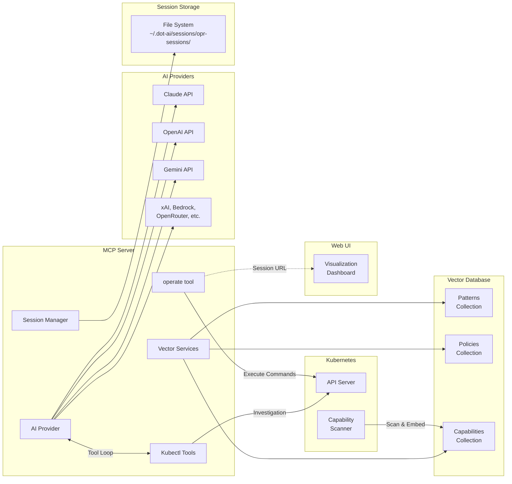

# Operate Feature Architecture

This document provides a detailed architecture overview of the Operate feature in the DevOps AI Toolkit.

## Overview

The Operate feature provides AI-powered Day 2 operations for Kubernetes applications. It handles updates, scaling, enhancements, rollbacks, and deletions through natural language intents while applying organizational patterns and policies, validating changes via dry-run, and executing approved operations safely.

## High-Level Architecture


## Operation Workflow

The operate tool implements a three-phase workflow with persistent session management:


## Component Details

### MCP Server (dot-ai)

The MCP server provides the core operations engine:

| Component | File | Description |
|-----------|------|-------------|
| `operate` tool | `src/tools/operate.ts` | Entry point, routing, context embedding, formatting |
| Analysis workflow | `src/tools/operate-analysis.ts` | Intent analysis, AI tool loop, response parsing |
| Execution workflow | `src/tools/operate-execution.ts` | Command execution, post-validation, results |
| System Prompt | `prompts/operate-system.md` | AI instructions for operation behavior |
| User Prompt | `prompts/operate-user.md` | Handlebars template with context injection |
| `GenericSessionManager` | `src/core/generic-session-manager.ts` | File-based session persistence |
| `AIProvider` | `src/core/ai-provider.interface.ts` | AI abstraction with tool loop support |
| `kubectl-tools` | `src/core/kubectl-tools.ts` | Kubectl investigation and validation tools |
| Vector Services | `src/services/*-vector-service.ts` | Pattern, policy, capability search |
| `visualization` | `src/core/visualization.ts` | URL generation for web UI |

### Kubectl Investigation & Validation Tools

Tools available during AI analysis:

| Tool | Description |
|------|-------------|
| `kubectl_api_resources` | Discover available resources in cluster |
| `kubectl_get` | List resources with table format |
| `kubectl_describe` | Detailed resource information with events |
| `kubectl_logs` | Container logs for debugging |
| `kubectl_patch_dryrun` | Validate patch operations before execution |
| `kubectl_apply_dryrun` | Validate apply operations before execution |
| `kubectl_delete_dryrun` | Validate delete operations before execution |
| `kubectl_get_crd_schema` | Get CRD schema for custom resources |

### Controller (dot-ai-controller)

The Kubernetes controller provides capability scanning:

| Component | File | Description |
|-----------|------|-------------|
| Capability Scanner | `internal/controller/capability_scanner.go` | Discovers cluster resources and capabilities |
| Embedding Service | `internal/controller/embedding_service.go` | Generates embeddings for semantic search |
| Qdrant Client | `internal/controller/qdrant_client.go` | Stores capabilities in vector database |

### Web UI (dot-ai-ui)

Provides visualization for operation analysis and execution:

| Component | File | Description |
|-----------|------|-------------|
| Visualization Page | `src/pages/Visualization.tsx` | Main page for `/v/{sessionId}` |
| MermaidRenderer | `src/components/renderers/MermaidRenderer.tsx` | Interactive flowcharts |
| CardRenderer | `src/components/renderers/CardRenderer.tsx` | Current state and proposed changes |
| CodeRenderer | `src/components/renderers/CodeRenderer.tsx` | Commands with syntax highlighting |
| InsightsPanel | `src/components/InsightsPanel.tsx` | AI observations and risk assessment |

## Integration Points



### MCP Server ↔ AI Provider

- **Tool Loop**: AI iteratively calls kubectl tools (max 30 iterations)
- **Investigation**: Gathers current cluster state to understand resources
- **Dry-Run Validation**: Validates all commands before proposing
- **Analysis**: Generates JSON response with changes, commands, and risk assessment

### MCP Server ↔ Vector Database

- **Patterns**: Organizational patterns for operational best practices
- **Policies**: Policy intents for validation and compliance
- **Capabilities**: Cluster resource capabilities for intelligent recommendations
- Capabilities are **mandatory**; patterns/policies are optional

### MCP Server ↔ Kubernetes API

- **Read Operations**: `kubectl get`, `describe`, `logs`
- **Validation**: `kubectl patch/apply/delete --dry-run=server`
- **Execution**: Sequential command execution via `child_process.exec()`

### MCP Server ↔ Remediate Tool

- **Post-Execution Validation**: Internally calls remediate with `validationIntent`
- **Verification**: Confirms operations completed successfully
- **Error Detection**: Identifies issues introduced by operations

### MCP Server ↔ Web UI

- **Session Storage**: Operation data stored with session IDs
- **Visualization API**: `/api/v1/visualize/{sessionId}` endpoint
- **URL Generation**: `WEB_UI_BASE_URL/v/{sessionId}`

## Session Management

Sessions persist workflow state across tool calls:

```
Session ID Format: opr-{timestamp}-{uuid8}
Example: opr-1704067200000-a1b2c3d4

Session Data:
├── toolName: 'operate'
├── intent: "Update my-api to v2.0 with zero downtime"
├── context:
│   ├── patterns: OrganizationalPattern[]
│   ├── policies: PolicyIntent[]
│   └── capabilities: ResourceCapability[]
├── proposedChanges:
│   ├── create: ResourceChange[]
│   ├── update: ResourceChange[]
│   └── delete: ResourceChange[]
├── commands: ["kubectl set image...", "kubectl patch..."]
├── dryRunValidation:
│   ├── status: 'success' | 'failed'
│   └── details: string
├── patternsApplied: ["Zero-Downtime Rolling Update"]
├── capabilitiesUsed: ["metrics-server", "KEDA"]
├── policiesChecked: ["Production Update Policy"]
├── risks: { level: 'low', description: "..." }
├── validationIntent: "Verify deployment rollout complete"
├── status: 'analyzing' | 'analysis_complete' | 'executing' | 'executed_*'
└── executionResults: [{command, success, output, error}]
```

### Session States

| State | Description |
|-------|-------------|
| `analyzing` | AI is gathering data and generating commands |
| `analysis_complete` | Analysis done, awaiting user approval |
| `executing` | Commands are being executed |
| `executed_successfully` | All commands succeeded |
| `executed_with_errors` | Some commands failed |
| `failed` | Analysis or execution failed |

## Organizational Context Integration

The operate tool integrates organizational knowledge via vector database search:


### Context Priority

1. **Capabilities** (Mandatory): What the cluster can do
2. **Patterns** (Optional): Organizational best practices
3. **Policies** (Optional): Compliance and validation rules

## Output Formats

The operate tool returns structured output at different stages:

### Analysis Response

| Field | Description |
|-------|-------------|
| `status` | `awaiting_user_approval` |
| `sessionId` | Session ID for continuation |
| `visualizationUrl` | URL to view analysis in web UI |
| `currentState` | Current cluster resource state |
| `proposedChanges` | Create, update, delete operations |
| `commands` | Pre-validated kubectl commands |
| `dryRunValidation` | Dry-run validation results |
| `patternsApplied` | Applied organizational patterns |
| `capabilitiesUsed` | Used cluster capabilities |
| `policiesChecked` | Checked policies |
| `risks` | Risk assessment (level + description) |
| `validationIntent` | Post-execution validation instructions |

### Execution Response

| Field | Description |
|-------|-------------|
| `status` | `success` or `failed` |
| `sessionId` | Session ID for reference |
| `results` | Per-command execution results |
| `validation` | Post-execution validation summary |
| `message` | Human-readable summary |

## Error Handling

The operation workflow includes robust error handling:

1. **No Capabilities Found**: Clear guidance to run capability scan first
2. **Session Not Found**: Guidance to start new operation
3. **Dry-Run Failures**: AI iterates to fix commands before proposing
4. **Command Execution Failures**: Continue-on-error, capture all results
5. **Validation Failures**: Report issues via remediate tool integration
6. **AI Service Errors**: Logged with request IDs for debugging
7. **Investigation Timeouts**: Max 30 iterations prevents infinite loops

## Configuration

### Environment Variables

| Variable | Description | Default |
|----------|-------------|---------|
| `AI_PROVIDER` | AI provider selection | `anthropic` |
| `ANTHROPIC_API_KEY` | Anthropic API key | Required if using |
| `OPENAI_API_KEY` | OpenAI API key | Required if using |
| `QDRANT_URL` | Qdrant vector database URL | `http://localhost:6333` |
| `QDRANT_API_KEY` | Qdrant API key | Optional |
| `QDRANT_CAPABILITIES_COLLECTION` | Capabilities collection name | `capabilities` |
| `KUBECONFIG` | Kubernetes config path | Auto-detected |
| `DOT_AI_SESSION_DIR` | Session storage directory | `~/.dot-ai/sessions` |
| `WEB_UI_BASE_URL` | Web UI base URL | Optional |
| `DEBUG_DOT_AI` | Enable debug logging | `false` |

### Supported AI Providers

| Provider | Models | Notes |
|----------|--------|-------|
| Anthropic | Claude Sonnet 4.5, Opus, Haiku | Default, 1M token context |
| OpenAI | GPT-5.1-codex | |
| Google | Gemini 3 Pro, Flash | |
| xAI | Grok-4 | |
| Amazon Bedrock | Various | Uses AWS credential chain |
| OpenRouter | Multi-model | Proxy to multiple providers |
| Custom | Ollama, vLLM, LocalAI | Via `baseURL` config |

## Workflow Example

```
User Intent: "Update my-api deployment in prod to v2.0 with zero downtime"

1. CONTEXT EMBEDDING
   └─ embedContext(intent)
      ├─ Search patterns → "Zero-Downtime Rolling Update"
      ├─ Search policies → "Production Update Requirements"
      └─ Search capabilities → "metrics-server", "KEDA Operator"

2. AI INVESTIGATION LOOP
   └─ AI Tool Loop (30 iterations max)
      ├─ kubectl_get deployment/my-api -n prod
      ├─ kubectl_describe deployment/my-api -n prod
      ├─ kubectl_patch_dryrun (test maxUnavailable: 0)
      └─ kubectl_set_image (test v2.0 image --dry-run=server)

3. ANALYSIS GENERATION
   └─ Session created: opr-1704067200000-a1b2c3d4
      ├─ Status: analysis_complete
      ├─ Current: 3 replicas, my-api:v1.5, maxUnavailable: 1
      ├─ Proposed: image v2.0, maxUnavailable: 0
      ├─ Commands: set image + patch strategy
      ├─ Risk: LOW
      └─ Visualization URL: https://dot-ai-ui/v/opr-1704067200000-a1b2c3d4

4. USER APPROVAL
   └─ User reviews analysis in terminal or web UI
      └─ Calls: operate({ sessionId: 'opr-...', executeChoice: 1 })

5. COMMAND EXECUTION
   └─ executeOperations()
      ├─ Load session (status: analysis_complete)
      ├─ Update status to executing
      ├─ Execute commands sequentially
      │  ├─ kubectl set image deployment/my-api my-api=my-api:v2.0 -n prod
      │  └─ kubectl patch deployment/my-api -n prod -p '{"spec":...}'
      ├─ Call remediate internally for validation
      └─ Update status to executed_successfully

6. RETURN RESULTS
   └─ Results: 2 commands succeeded
      ├─ Validation: "Rollout complete, all pods running v2.0"
      └─ Status: success
```

## See Also

- [MCP Operate Guide](https://devopstoolkit.ai/mcp/operate/)
- [Remediate Architecture](./remediate.md)
- [Recommendation Architecture](./recommendation.md)
- [Controller Documentation](https://devopstoolkit.ai/controller/)
- [Web UI Documentation](https://devopstoolkit.ai/ui/)
