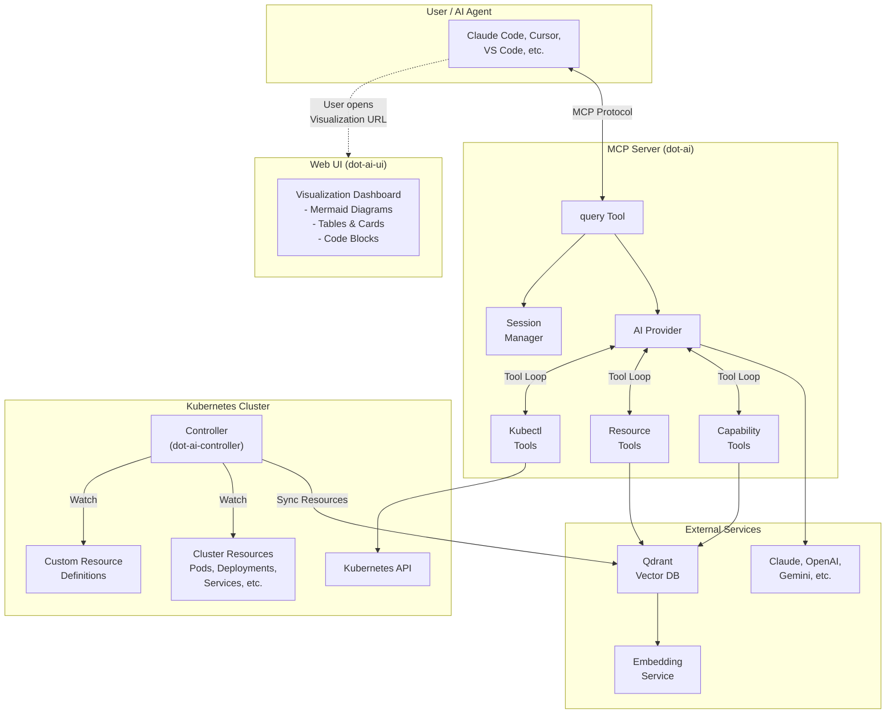
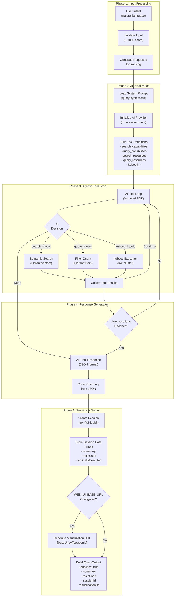
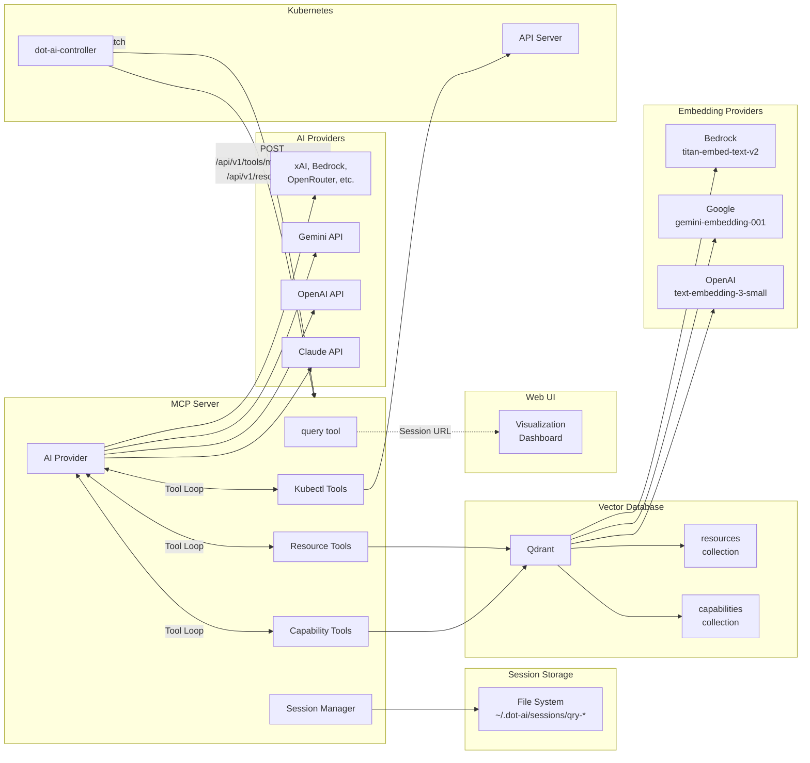
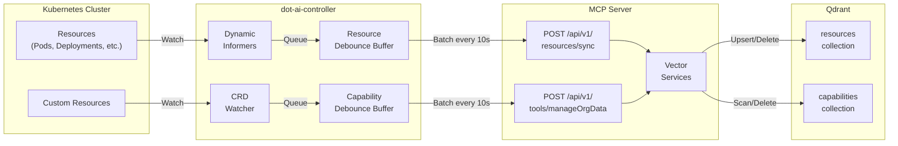

# Query Feature Architecture

This document provides a detailed architecture overview of the Query feature in the DevOps AI Toolkit.

## Overview

The Query feature provides a natural language interface for Kubernetes cluster intelligence. Users can ask questions about cluster resources, capabilities, and status in plain English, with the AI autonomously deciding which tools to call to gather the necessary information.

## High-Level Architecture



## Query Workflow

The query tool operates as an agentic loop where the AI autonomously decides which tools to call:



## Component Details

### MCP Server (dot-ai)

The MCP server hosts the query tool and orchestrates AI-driven investigation:

| Component | File | Description |
|-----------|------|-------------|
| `query` tool | `src/tools/query.ts` | Entry point, orchestrates tool loop and session |
| System Prompt | `prompts/query-system.md` | AI instructions for query behavior |
| `GenericSessionManager` | `src/core/generic-session-manager.ts` | File-based session persistence |
| `AIProvider` | `src/core/ai-provider.interface.ts` | AI abstraction with tool loop support |
| `AIProviderFactory` | `src/core/ai-provider-factory.ts` | Multi-provider factory |
| `capability-tools` | `src/core/capability-tools.ts` | Semantic search for capabilities |
| `resource-tools` | `src/core/resource-tools.ts` | Semantic search for resources |
| `kubectl-tools` | `src/core/kubectl-tools.ts` | Kubectl read-only tools |
| `CapabilityVectorService` | `src/core/capability-vector-service.ts` | Capability embeddings storage |
| `ResourceVectorService` | `src/core/resource-vector-service.ts` | Resource embeddings storage |
| `EmbeddingService` | `src/core/embedding-service.ts` | Multi-provider embedding generation |
| `visualization` | `src/core/visualization.ts` | URL generation for web UI |

### Query Tools Available to AI

The AI can autonomously call these tools during investigation:

| Tool | Type | Description |
|------|------|-------------|
| `search_capabilities` | Semantic | Vector similarity search for resource capabilities |
| `query_capabilities` | Filter | Structured filter queries for capabilities |
| `search_resources` | Semantic | Vector similarity search for cluster resources |
| `query_resources` | Filter | Structured filter queries for resources |
| `kubectl_api_resources` | Kubectl | List all available API resources |
| `kubectl_get` | Kubectl | Get resources with current state |
| `kubectl_describe` | Kubectl | Detailed resource information |
| `kubectl_logs` | Kubectl | Container logs from pods |
| `kubectl_events` | Kubectl | Kubernetes events for troubleshooting |
| `kubectl_get_crd_schema` | Kubectl | OpenAPI v3 schema for CRDs |

### Controller (dot-ai-controller)

The Kubernetes controller syncs cluster data to Qdrant for semantic search:

| Component | File | Description |
|-----------|------|-------------|
| `ResourceSyncReconciler` | `internal/controller/resourcesync_controller.go` | Watches all resources, syncs to MCP |
| `CapabilityScanReconciler` | `internal/controller/capabilityscan_controller.go` | Triggers capability scans on CRD changes |
| `ResourceSyncConfig` CRD | `api/v1alpha1/resourcesyncconfig_types.go` | Configuration for resource sync |
| `CapabilityScanConfig` CRD | `api/v1alpha1/capabilityscanconfig_types.go` | Configuration for capability scanning |
| MCP Resource Client | `internal/controller/resourcesync_mcp.go` | HTTP client for `/api/v1/resources/sync` |
| MCP Capability Client | `internal/controller/capabilityscan_mcp.go` | HTTP client for `/api/v1/tools/manageOrgData` |
| Debounce Buffer | `internal/controller/resourcesync_debounce.go` | Batches changes before sync |

### Web UI (dot-ai-ui)

Provides visualization for query results:

| Component | File | Description |
|-----------|------|-------------|
| Visualization Page | `src/pages/Visualization.tsx` | Main page for `/v/{sessionId}` |
| MermaidRenderer | `src/components/renderers/MermaidRenderer.tsx` | Interactive diagrams with zoom/pan |
| CardRenderer | `src/components/renderers/CardRenderer.tsx` | Resource cards in grid layout |
| TableRenderer | `src/components/renderers/TableRenderer.tsx` | Tabular data display |
| CodeRenderer | `src/components/renderers/CodeRenderer.tsx` | Syntax-highlighted code/YAML |
| InsightsPanel | `src/components/InsightsPanel.tsx` | AI observations display |
| TabContainer | `src/components/TabContainer.tsx` | Multi-visualization tabs |
| API Client | `src/api/client.ts` | Data fetching from MCP server |

## Integration Points



### MCP Server ↔ AI Provider

- **Tool Loop**: AI iteratively calls tools (max 20 iterations by default)
- **Autonomous Decision**: AI decides which tools to call based on user intent
- **JSON Output**: AI returns structured JSON with summary

### MCP Server ↔ Qdrant

- **Semantic Search**: Vector similarity using embeddings
- **Filter Queries**: Structured queries by namespace, kind, labels, etc.
- **Capability Data**: Resource kinds with capabilities, providers, abstractions
- **Resource Data**: Cluster resources with labels, annotations, timestamps

### Controller ↔ MCP Server

- **Resource Sync**: Controller watches all resources and syncs to MCP
- **Capability Scanning**: Controller triggers scans when CRDs change
- **Debounced Batching**: Changes batched every 10s to reduce API calls
- **Periodic Resync**: Full resync every 60 minutes for consistency

### MCP Server ↔ Web UI

- **Session Storage**: Query results stored with session IDs
- **Visualization API**: `/api/v1/visualize/{sessionId}` endpoint
- **URL Generation**: `WEB_UI_BASE_URL/v/{sessionId}`
- **Cached Visualizations**: AI-generated visualizations cached in session

## Session Management

Sessions persist query data for visualization:

```
Session ID Format: qry-{timestamp}-{uuid8}
Example: qry-1767465086590-a1b2c3d4

Session Data:
├── toolName: 'query'
├── intent: "What databases are running in the cluster?"
├── summary: "Found 3 PostgreSQL clusters and 2 Redis instances..."
├── toolsUsed: ['search_capabilities', 'kubectl_get', ...]
├── iterations: 5
├── toolCallsExecuted:
│   ├── {tool: 'search_capabilities', input: {...}, output: {...}}
│   ├── {tool: 'kubectl_get', input: {...}, output: {...}}
│   └── ...
├── cachedVisualization:
│   ├── title: "Database Resources"
│   ├── visualizations: [...]
│   ├── insights: [...]
│   └── generatedAt: ISO timestamp
└── timestamp: ISO date
```

## Data Flow: Resource Sync



## Output Formats

The query tool returns structured output:

| Field | Description |
|-------|-------------|
| `success` | Boolean indicating query success |
| `summary` | Human-readable summary of findings |
| `toolsUsed` | List of tools called during investigation |
| `iterations` | Number of AI tool loop iterations |
| `sessionId` | Session ID for visualization |
| `visualizationUrl` | URL to view results (if configured) |
| `guidance` | Instructions for agent on presenting results |
| `error` | Error object with code and message (if failed) |

## Error Handling

The query workflow includes robust error handling:

1. **Input Validation**: Intent must be non-empty string (1-1000 chars)
2. **AI Provider Errors**: Logged with request IDs for debugging
3. **Vector DB Unavailable**: Falls back to keyword search or kubectl-only
4. **JSON Parsing Failures**: Original AI response logged for analysis
5. **Tool Execution Errors**: Captured in toolCallsExecuted, investigation continues
6. **Max Iterations**: Default 20 iterations prevents infinite loops

## Configuration

### Environment Variables

| Variable | Description | Default |
|----------|-------------|---------|
| `AI_PROVIDER` | AI provider selection | `anthropic` |
| `ANTHROPIC_API_KEY` | Anthropic API key | Required if using |
| `OPENAI_API_KEY` | OpenAI API key | Required if using |
| `QDRANT_URL` | Qdrant vector DB endpoint | `http://localhost:6333` |
| `QDRANT_API_KEY` | Qdrant authentication | Optional |
| `QDRANT_CAPABILITIES_COLLECTION` | Capabilities collection name | `capabilities` |
| `QDRANT_RESOURCES_COLLECTION` | Resources collection name | `resources` |
| `CUSTOM_EMBEDDINGS_API_KEY` | Embedding service API key | Falls back to provider key |
| `KUBECONFIG` | Kubernetes config path | Auto-detected |
| `WEB_UI_BASE_URL` | Web UI base URL | Optional |
| `DEBUG_DOT_AI` | Enable debug logging | `false` |

### Supported AI Providers

| Provider | Models | Notes |
|----------|--------|-------|
| Anthropic | Claude Sonnet 4.5, Opus, Haiku | Default, 1M token context |
| OpenAI | GPT-5.1-codex | |
| Google | Gemini 3 Pro, Flash | |
| xAI | Grok-4 | |
| Amazon Bedrock | Various | Uses AWS credential chain |
| OpenRouter | Multi-model | Proxy to multiple providers |
| Custom | Ollama, vLLM, LocalAI | Via `baseURL` config |

### Supported Embedding Providers

| Provider | Model | Dimensions |
|----------|-------|------------|
| OpenAI | text-embedding-3-small | 1536 |
| Google | gemini-embedding-001 | 768 |
| Amazon Bedrock | titan-embed-text-v2:0 | 1024 |

## See Also

- [MCP Query Guide](https://devopstoolkit.ai/mcp/query/)
- [Controller Documentation](https://devopstoolkit.ai/controller/)
- [Web UI Documentation](https://devopstoolkit.ai/ui/)
- [Vector Database Setup](https://devopstoolkit.ai/setup/qdrant/)
