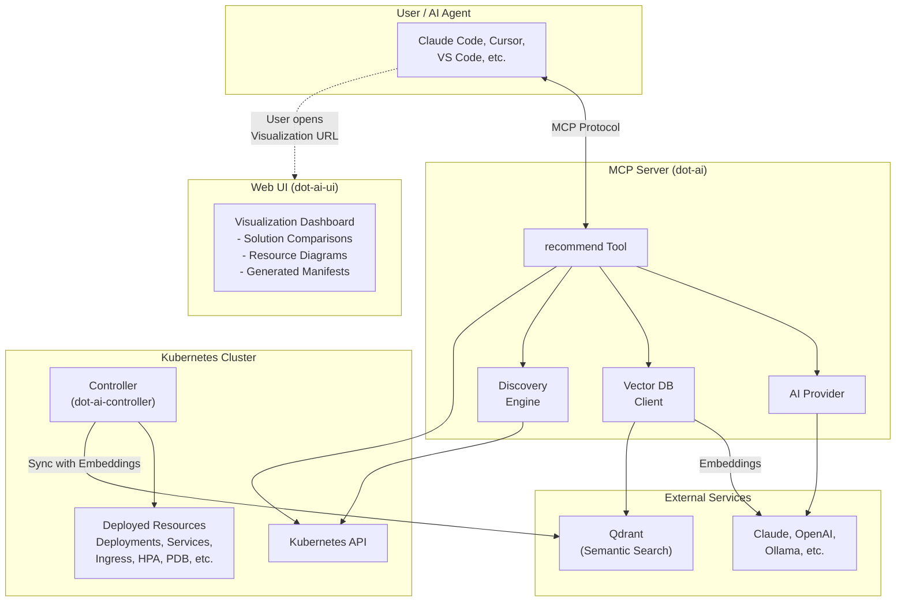
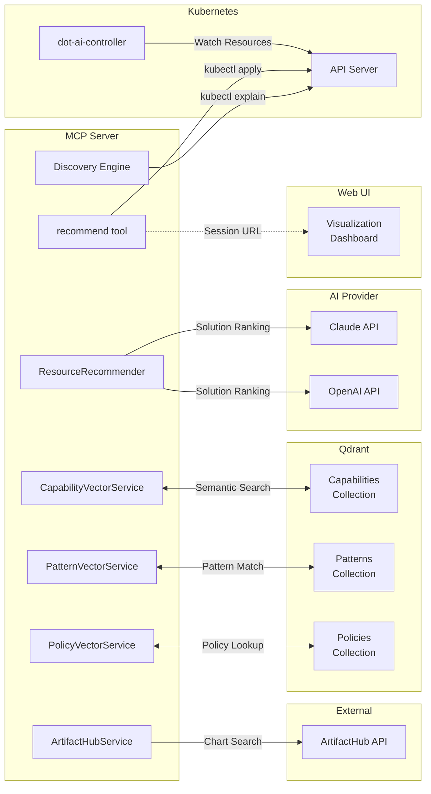

# Recommendation Feature Architecture

This document provides a detailed architecture overview of the Recommendation feature in the DevOps AI Toolkit.

## Overview

The Recommendation feature provides AI-powered Kubernetes deployment recommendations. It analyzes user intent, discovers cluster capabilities, and generates deployment solutions with full manifest generation and deployment capabilities.

## High-Level Architecture



## Recommendation Workflow Stages

The recommendation tool operates as a unified multi-stage workflow:

```mermaid
flowchart TD
    subgraph Stage1["Stage 1: recommend"]
        UserIntent["User Intent"]
        IntentCheck{"Intent < 100 chars?"}
        Refine["Return Refinement Guidance"]
        CapSearch["Capability Search<br/>(Vector DB)"]
        AIRank["AI Ranking<br/>(Claude)"]
        CapMatch{"Capability<br/>Match?"}
        ResourceSol["Generate Resource-Based<br/>Solutions"]
        HelmSearch["Search ArtifactHub<br/>for Helm Charts"]
        Solutions["Solutions with solutionIds<br/>+ visualization URL"]

        UserIntent --> IntentCheck
        IntentCheck -->|Yes| Refine
        IntentCheck -->|No| CapSearch
        CapSearch --> AIRank
        AIRank --> CapMatch
        CapMatch -->|Yes| ResourceSol
        CapMatch -->|No| HelmSearch
        ResourceSol --> Solutions
        HelmSearch --> Solutions
    end

    subgraph Stage2["Stage 2: chooseSolution"]
        SelectSol["solutionId"]
        LoadSession["Load Session"]
        GenQuestions["Generate Questions<br/>(if Helm)"]
        ReturnQuestions["Required Questions"]

        SelectSol --> LoadSession --> GenQuestions --> ReturnQuestions
    end

    subgraph Stage3["Stage 3-6: answerQuestion"]
        Required["answerQuestion:required<br/>(name, namespace, image, port)"]
        Basic["answerQuestion:basic<br/>(replicas, resources, ingress)"]
        Advanced["answerQuestion:advanced<br/>(probes, PDB, security)"]
        Open["answerQuestion:open<br/>(free-form, AI enhancement)"]
        Ready["ready_for_manifest_generation"]

        Required --> Basic --> Advanced --> Open --> Ready
    end

    subgraph Stage4["Stage 7: generateManifests"]
        GenType{"Solution<br/>Type?"}

        subgraph Capability["Capability-Based"]
            C1["1. Retrieve Schemas"]
            C2["2. AI Generation"]
            C3["3. YAML Validation"]
            C4["4. kubectl Dry-Run"]
            C5["5. Retry Loop (max 10)"]
            C6["6. Package Output"]
            C1 --> C2 --> C3 --> C4 --> C5 --> C6
        end

        subgraph Helm["Helm-Based"]
            H1["1. Fetch Chart"]
            H2["2. AI Values Gen"]
            H3["3. Helm Dry-Run"]
            H4["4. Retry Loop"]
            H1 --> H2 --> H3 --> H4
        end

        GenType -->|Capability| C1
        GenType -->|Helm| H1
        C6 --> Manifests
        H4 --> Manifests
        Manifests["Manifests + visualization URL"]
    end

    subgraph Stage5["Stage 8: deployManifests"]
        DeployType{"Solution<br/>Type?"}

        CapDeploy["kubectl apply -k<br/>--wait"]
        HelmDeploy["helm upgrade<br/>--install --wait"]
        Status["Deployment Status<br/>+ Next Steps"]

        DeployType -->|Capability| CapDeploy
        DeployType -->|Helm| HelmDeploy
        CapDeploy --> Status
        HelmDeploy --> Status
    end

    Solutions --> SelectSol
    ReturnQuestions --> Required
    Ready --> GenType
    Manifests --> DeployType
```



## Component Details

### MCP Server (dot-ai)

The MCP server is the core recommendation engine:

| Component | File | Description |
|-----------|------|-------------|
| `recommend` tool | `src/tools/recommend.ts` | Entry point, routes to stages, generates solutions |
| `chooseSolution` | `src/tools/choose-solution.ts` | Loads selected solution, returns questions |
| `answerQuestion` | `src/tools/answer-question.ts` | Processes answers, manages stage progression |
| `generateManifests` | `src/tools/generate-manifests.ts` | AI manifest generation with validation loop |
| `deployManifests` | `src/tools/deploy-manifests.ts` | Deploys via kubectl or helm |
| `ResourceRecommender` | `src/core/schema.ts` | AI-powered solution ranking and filtering |
| `CapabilityVectorService` | `src/core/capability-vector-service.ts` | Semantic search for capabilities |
| `PatternVectorService` | `src/core/pattern-vector-service.ts` | Organizational pattern matching |
| `PolicyVectorService` | `src/core/policy-vector-service.ts` | Policy enforcement |
| `GenericSessionManager` | `src/core/generic-session-manager.ts` | Session state management |
| `ArtifactHubService` | `src/core/artifacthub.ts` | Helm chart discovery |

### Controller (dot-ai-controller)

The Kubernetes controller manages deployed solutions:

| CRD | Description |
|-----|-------------|
| `Solution` | Groups related resources, manages ownerReferences, aggregates health |
| `ResourceSyncConfig` | Syncs resource metadata to MCP for semantic search |
| `CapabilityScanConfig` | Scans cluster for resource capabilities |
| `RemediationPolicy` | Event-driven remediation (separate feature) |

### Web UI (dot-ai-ui)

Provides visualization for recommendation results:

- **Visualization Page** (`/v/{sessionId}`) - Renders solution comparisons
- **Mermaid Diagrams** - Architecture and flow diagrams
- **Resource Cards** - Solution component details
- **Code Blocks** - Generated manifests with syntax highlighting
- **Tables** - Configuration summaries

## Integration Points



### MCP Server ↔ Vector DB (Qdrant)

- **Capability Storage**: Resource capabilities with semantic embeddings
- **Pattern Storage**: Organizational patterns for solution enhancement
- **Policy Storage**: Policy intents for configuration enforcement
- **Semantic Search**: Natural language queries matched to stored data

### MCP Server ↔ Kubernetes API

- **Resource Discovery**: `kubectl api-resources`, `kubectl explain`
- **Schema Retrieval**: OpenAPI schemas for manifest generation
- **Manifest Validation**: `kubectl apply --dry-run=server`
- **Deployment**: `kubectl apply`, `helm upgrade --install`

### MCP Server ↔ AI Provider

- **Solution Assembly**: Ranking and filtering discovered capabilities
- **Question Generation**: Creating configuration questions from schemas
- **Manifest Generation**: Generating YAML from solution + answers
- **Helm Values**: Generating values.yaml for chart installations

### MCP Server ↔ Web UI

- **Session Storage**: Solution data stored with session IDs
- **Visualization API**: `/api/visualize/{sessionId}` endpoint
- **URL Generation**: `WEB_UI_BASE_URL/v/{sessionId}`

### Controller ↔ MCP Server

- **Resource Sync**: Controller syncs resource metadata to MCP
- **Capability Scan**: Controller triggers capability discovery
- **Solution CR**: MCP generates Solution CR for controller management

## Session Management

Sessions persist workflow state across tool calls:

```
Session ID Format: sol-{timestamp}-{uuid8}
Example: sol-1765409923079-fa3f055c

Session Data:
├── toolName: 'recommend'
├── stage: 'recommend' | 'generateManifests' | ...
├── intent: "Deploy PostgreSQL database"
├── type: 'single' | 'combination' | 'helm'
├── score: 96
├── description: "Multi-cloud PostgreSQL via DevOps Toolkit"
├── resources: [{kind, apiVersion, group, description}]
├── chart: {repository, chartName, version} (if Helm)
├── questions: {required, basic, advanced, open}
├── answers: {questionId: value}
├── appliedPatterns: ["DevOps Toolkit DB Pattern"]
├── generatedManifests: {type, files, helmCommand}
└── timestamp: ISO date
```

## Output Formats

The recommendation tool supports three output formats for capability-based solutions:

| Format | Description | Files Generated |
|--------|-------------|-----------------|
| `raw` | Plain YAML manifests | `manifests.yaml` |
| `helm` | Helm chart structure | `Chart.yaml`, `values.yaml`, `templates/*.yaml` |
| `kustomize` | Kustomize overlay | `kustomization.yaml`, `base/`, `overlays/` |

## Error Handling

The recommendation workflow includes robust error handling:

1. **Intent Refinement**: Vague intents get guidance, not failure
2. **Validation Loops**: Up to 10 retries for manifest generation
3. **Capability Gaps**: Clear error when enhancement isn't possible
4. **Session Expiry**: Graceful handling of expired sessions
5. **AI Service Errors**: Fallback to original solution on enhancement failure

## See Also

- [MCP Recommendation Guide](https://devopstoolkit.ai/mcp/recommend/)
- [Capability Management Guide](https://devopstoolkit.ai/mcp/capability-management/)
- [Pattern Management Guide](https://devopstoolkit.ai/mcp/pattern-management/)
- [Controller Documentation](https://devopstoolkit.ai/controller/)
- [Web UI Documentation](https://devopstoolkit.ai/ui/)
