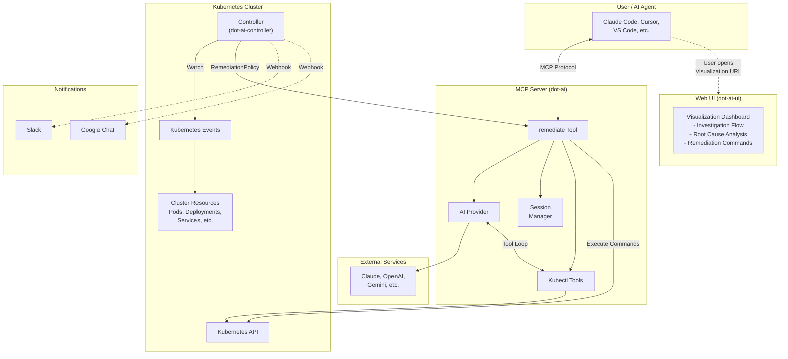
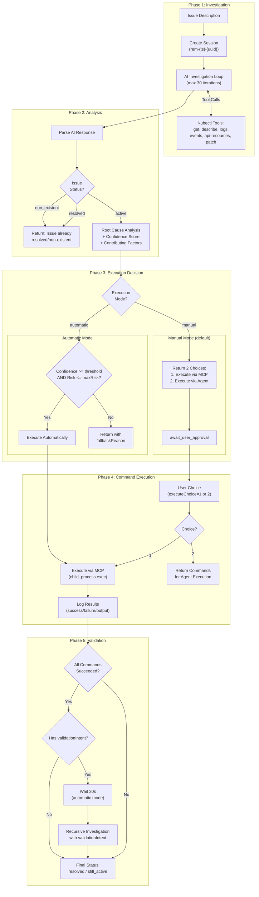
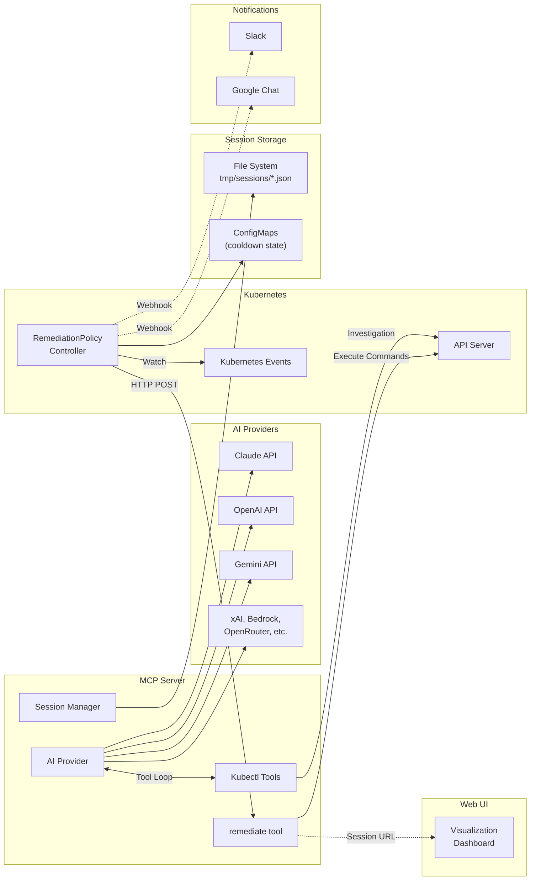

# Remediate Feature Architecture

This document provides a detailed architecture overview of the Remediate feature in the DevOps AI Toolkit.

## Overview

The Remediate feature provides AI-powered Kubernetes issue analysis and remediation. It investigates problems using kubectl tools, identifies root causes with confidence scoring, and executes verified fixes with optional post-execution validation.

## High-Level Architecture



## Remediation Workflow

The remediate tool operates as a multi-phase workflow with persistent session management:



## Component Details

### MCP Server (dot-ai)

The MCP server is the core remediation engine:

| Component | File | Description |
|-----------|------|-------------|
| `remediate` tool | `src/tools/remediate.ts` | Entry point, orchestrates investigation and execution |
| System Prompt | `prompts/remediate-system.md` | AI instructions for investigation behavior |
| `GenericSessionManager` | `src/core/generic-session-manager.ts` | File-based session persistence |
| `AIProvider` | `src/core/ai-provider.interface.ts` | AI abstraction with tool loop support |
| `AIProviderFactory` | `src/core/ai-provider-factory.ts` | Multi-provider factory (Anthropic, OpenAI, etc.) |
| `kubectl-tools` | `src/core/kubectl-tools.ts` | Kubectl investigation tools |
| `visualization` | `src/core/visualization.ts` | URL generation for web UI |

### Kubectl Investigation Tools

Tools available during AI investigation:

| Tool | Description |
|------|-------------|
| `kubectl_api_resources` | Discover available resources in cluster |
| `kubectl_get` | List resources with table format (compact) |
| `kubectl_describe` | Detailed resource information with events |
| `kubectl_logs` | Container logs (supports `--previous` for crashes) |
| `kubectl_events` | Cluster events for understanding state changes |
| `kubectl_patch_dryrun` | Validate patches before actual execution |

### Controller (dot-ai-controller)

The Kubernetes controller provides event-driven remediation:

| Component | File | Description |
|-----------|------|-------------|
| `RemediationPolicy` CRD | `config/crd/bases/` | Custom resource for remediation rules |
| Policy Controller | `internal/controller/remediationpolicy_controller.go` | Event matching and MCP dispatch |
| Rate Limiter | `internal/controller/remediationpolicy_ratelimit.go` | Per-object cooldowns and rate limits |
| MCP Client | `internal/controller/remediationpolicy_mcp.go` | HTTP client for remediate tool |
| Cooldown State | ConfigMaps | Persistent cooldown state across restarts |

### Web UI (dot-ai-ui)

Provides visualization for remediation results:

| Component | File | Description |
|-----------|------|-------------|
| Visualization Page | `src/pages/Visualization.tsx` | Main page for `/v/{sessionId}` |
| MermaidRenderer | `src/components/renderers/MermaidRenderer.tsx` | Interactive flowcharts (collapsible) |
| CardRenderer | `src/components/renderers/CardRenderer.tsx` | Issue/solution cards |
| CodeRenderer | `src/components/renderers/CodeRenderer.tsx` | Commands and logs with syntax highlighting |
| InsightsPanel | `src/components/InsightsPanel.tsx` | AI observations display |
| API Client | `src/api/client.ts` | Data fetching from MCP server |

## Integration Points



### MCP Server ↔ AI Provider

- **Tool Loop**: AI iteratively calls kubectl tools (max 30 iterations)
- **Investigation**: Gathers cluster data to understand the issue
- **Analysis**: Parses JSON response with root cause, confidence, and remediation steps
- **Validation**: Optional recursive investigation after command execution

### MCP Server ↔ Kubernetes API

- **Read Operations**: `kubectl get`, `describe`, `logs`, `events`
- **Validation**: `kubectl patch --dry-run=server`
- **Execution**: `child_process.exec()` for remediation commands

### Controller ↔ MCP Server

- **Event-Driven**: Controller watches Kubernetes events
- **Policy Matching**: Events matched against RemediationPolicy selectors
- **HTTP Dispatch**: POST to MCP `/api/v1/tools/remediate`
- **Rate Limiting**: Per-object cooldowns prevent remediation storms

### MCP Server ↔ Web UI

- **Session Storage**: Remediation data stored with session IDs
- **Visualization API**: `/api/v1/visualize/{sessionId}` endpoint
- **URL Generation**: `WEB_UI_BASE_URL/v/{sessionId}`

### Controller ↔ Notifications

- **Slack Webhooks**: Controller sends remediation events to Slack channels
- **Google Chat Webhooks**: Controller sends remediation events to Google Chat spaces
- **Secret References**: Webhook URLs stored securely in Kubernetes Secrets
- **Event Types**: Notifications sent on remediation start, success, and failure

## Session Management

Sessions persist workflow state across tool calls:

```
Session ID Format: rem-{timestamp}-{uuid8}
Example: rem-1767465086590-11029192

Session Data:
├── toolName: 'remediate'
├── issue: "Pod my-app is crashing with OOMKilled"
├── mode: 'manual' | 'automatic'
├── interaction_id: (for evaluation dataset)
├── status: 'investigating' | 'analysis_complete' | 'executed_*' | ...
├── finalAnalysis:
│   ├── rootCause: "Container memory limit too low"
│   ├── confidence: 0.92
│   ├── factors: ["High memory usage", "No HPA"]
│   ├── remediation:
│   │   ├── summary: "Increase memory limit"
│   │   ├── actions: [{description, command, risk, rationale}]
│   │   └── risk: 'low' | 'medium' | 'high'
│   └── validationIntent: "Verify pod is running"
├── executionResults: [{command, success, output, error}]
└── timestamp: ISO date
```

### Session States

| State | Description |
|-------|-------------|
| `investigating` | AI is gathering data via kubectl tools |
| `analysis_complete` | Analysis done, awaiting user approval |
| `failed` | Investigation failed (error) |
| `executed_successfully` | All commands succeeded |
| `executed_with_errors` | Some commands failed |
| `cancelled` | User cancelled the remediation |

## RemediationPolicy CRD

The controller uses a CRD for event-driven remediation:

```yaml
apiVersion: dot-ai.devopstoolkit.live/v1alpha1
kind: RemediationPolicy
metadata:
  name: oom-killer-policy
spec:
  eventSelectors:
    - type: Warning
      reason: OOMKilled
      involvedObjectKind: Pod
      namespace: production
      message: ".*memory.*"  # Regex support
      mode: automatic        # Override per selector
      confidenceThreshold: 0.9
      maxRiskLevel: low

  mcpEndpoint: https://mcp.example.com/api/v1/tools
  mcpAuthSecretRef:
    name: mcp-auth
    key: token
  mcpTool: remediate

  mode: manual              # Default mode
  confidenceThreshold: 0.8
  maxRiskLevel: low

  rateLimiting:
    eventsPerMinute: 10
    cooldownMinutes: 5

  notifications:
    slack:
      webhookSecretRef:
        name: slack-webhook
        key: url
      channel: "#alerts"
    googleChat:
      webhookSecretRef:
        name: gchat-webhook
        key: url

status:
  totalEventsProcessed: 150
  successfulRemediations: 142
  failedRemediations: 8
  rateLimitedEvents: 25
  lastProcessedEvent: "2025-01-07T10:30:00Z"
```

## Output Formats

The remediate tool returns structured output:

| Field | Description |
|-------|-------------|
| `status` | `success`, `failed`, or `awaiting_user_approval` |
| `sessionId` | Session ID for continuation or visualization |
| `investigation.iterations` | Number of AI tool loop iterations |
| `investigation.dataGathered` | List of kubectl tools called |
| `analysis.rootCause` | Identified root cause |
| `analysis.confidence` | Confidence score (0-1) |
| `analysis.factors` | Contributing factors |
| `remediation.summary` | Human-readable summary |
| `remediation.actions` | Commands with risk levels |
| `remediation.risk` | Overall risk level |
| `validationIntent` | Post-execution validation instructions |
| `executionChoices` | Available execution options |
| `results` | Execution results (if executed) |

## Error Handling

The remediation workflow includes robust error handling:

1. **Session Not Found**: Clear guidance to start new investigation
2. **AI Service Errors**: Logged with request IDs for debugging
3. **JSON Parsing Failures**: Original AI response logged for analysis
4. **Command Execution Failures**: Individual command results tracked
5. **Validation Failures**: Recursive investigation continues despite errors
6. **Investigation Timeouts**: Max 30 iterations prevents infinite loops

## Configuration

### Environment Variables

| Variable | Description | Default |
|----------|-------------|---------|
| `AI_PROVIDER` | AI provider selection | `anthropic` |
| `ANTHROPIC_API_KEY` | Anthropic API key | Required if using |
| `OPENAI_API_KEY` | OpenAI API key | Required if using |
| `KUBECONFIG` | Kubernetes config path | Auto-detected |
| `DOT_AI_SESSION_DIR` | Session storage directory | `./tmp/sessions` |
| `WEB_UI_BASE_URL` | Web UI base URL | Optional |
| `DEBUG_DOT_AI` | Enable debug logging | `false` |

### Supported AI Providers

| Provider | Models | Notes |
|----------|--------|-------|
| Anthropic | Claude Sonnet 4.5, Opus, Haiku | Default, 1M token context |
| OpenAI | GPT-5.1-codex | |
| Google | Gemini 3 Pro, Flash | |
| xAI | Grok-4 | |
| Amazon Bedrock | Various | Uses AWS credential chain |
| OpenRouter | Multi-model | Proxy to multiple providers |
| Custom | Ollama, vLLM, LocalAI | Via `baseURL` config |

## See Also

- [MCP Remediate Guide](https://devopstoolkit.ai/mcp/remediate/)
- [Controller Documentation](https://devopstoolkit.ai/controller/)
- [Web UI Documentation](https://devopstoolkit.ai/ui/)
- [RemediationPolicy Reference](https://devopstoolkit.ai/controller/remediationpolicy/)
